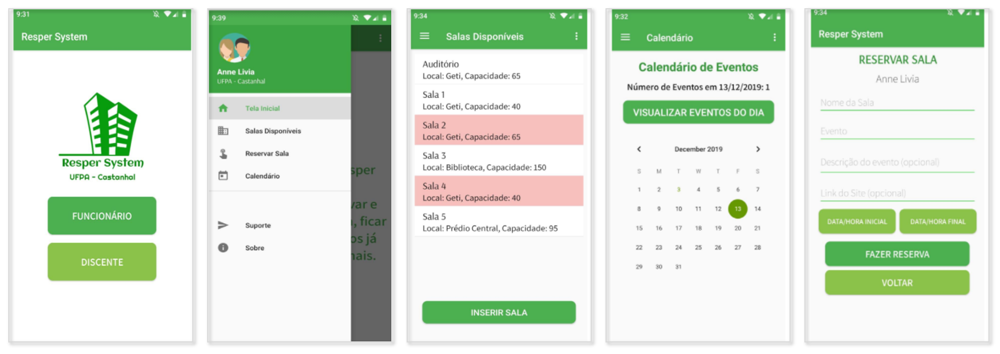

<h1 align="center">Resper System</h1>

This is an android mobile application that allows the reservation of a classroom or some other spaces available for lectures,  workshops, meetings and other events. The main objective of the App is to assist employees (Professors and administrative assistants) from Federal University of Pará, in the task of managing worspaces and places to hold events. While using the app, the employees of the institution will be able to check which rooms and auditoriums are available and on what dates, analyze the information about the capacity, its characteristics, as well as, reserve these spaces if applicable. In addition, the system will inform the days of the events and meetings already scheduled and, to avoid any delays or other technical problems, this application will inform about the state of these spaces, such as: it's reserved, under maintenance and so on.

## Developers
  - <a href="https://www.github.com/annelivia">Anne Livia</a> - Computer Faculty at UFPA
  - <a href="https://github.com/Marcos-Fernando">Marcos Costa</a> - Computer Faculty at UFPA
  
## Technologies
 - Android Studio
 - Java
 - Firebase

<h2 align="center"> Check out a few interfaces of the App </h2>

  </img>

<h2 align="center">© All Rights Reserved  </h2>
